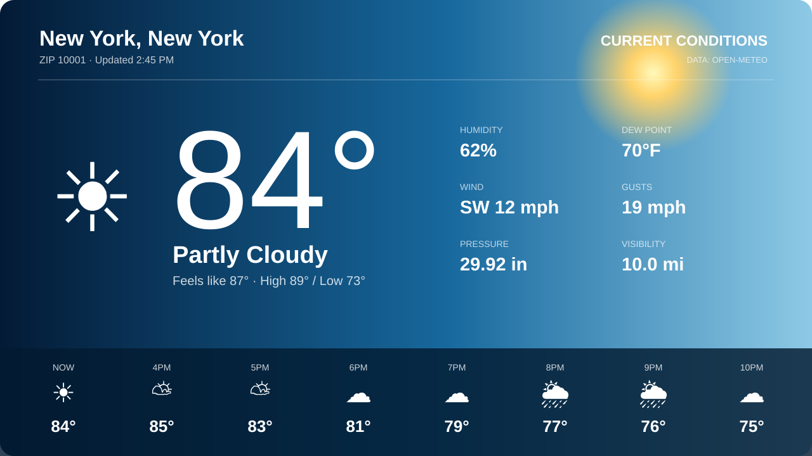

# Weather Channel Card



A responsive Weather Channel-inspired Home Assistant dashboard card. Enter a ZIP code and the card loads current conditions and an hourly forecast directly from Open-Meteo—no weather integration, API key, YAML package, or other custom card required.

## Install with HACS

Until this repository is included in HACS by default:

1. Open **HACS** in Home Assistant.
2. Select the three-dot menu → **Custom repositories**.
3. Add `https://github.com/InstigatorX/weather-channel-card`.
4. Select category **Dashboard** and choose **Add**.
5. Open the new repository and choose **Download**.
6. Refresh the browser. HACS normally registers the JavaScript resource automatically.

[](https://my.home-assistant.io/redirect/hacs_repository/?owner=InstigatorX&repository=weather-channel-card&category=plugin)

## Add the card

Minimal configuration:

```yaml
type: custom:weather-channel-card
zip_code: "10001"
```

Use a Home Assistant helper to change the ZIP without editing the dashboard:

```yaml
type: custom:weather-channel-card
zip_entity: input_text.weather_zip
```

Create the helper under **Settings → Devices & services → Helpers → Text**. Its entity ID can differ; use the actual ID in the card configuration.

## Full configuration

```yaml
type: custom:weather-channel-card
zip_code: "10001"
country_code: US
units: imperial
forecast_hours: 8
update_interval: 600
title: My Local Weather
alerts_entity: sensor.nws_alerts
lightning_entity: sensor.blitzortung_lightning_distance
background_url: /local/weather/default.jpg
backgrounds:
  clear_day: /local/weather/clear-day.jpg
  clear_night: /local/weather/clear-night.jpg
  cloudy: /local/weather/cloudy.jpg
  rain: /local/weather/rain.jpg
  snow: /local/weather/snow.jpg
  thunderstorm: /local/weather/storm.jpg
```

| Option | Default | Description |
|---|---:|---|
| `zip_code` | — | ZIP/postal code. Required unless `zip_entity` is set. |
| `zip_entity` | — | Text/input entity containing the ZIP. Takes precedence over `zip_code`. |
| `country_code` | `US` | ISO two-letter country filter. |
| `units` | `imperial` | `imperial` or `metric`. |
| `forecast_hours` | `8` | Number of hourly tiles, from 4 through 12. |
| `update_interval` | `600` | Refresh period in seconds; minimum 300. |
| `title` | Location name | Optional heading override. |
| `alerts_entity` | — | Optional official-alert sensor. |
| `lightning_entity` | — | Optional lightning-distance sensor. |
| `background_url` | — | Default `/local/`, `/hacsfiles/`, or HTTPS image. |
| `backgrounds` | — | Optional images selected for six condition groups. |

The heat-risk banner is computed from apparent temperature and is not presented as an official advisory. Official warnings only appear when `alerts_entity` is configured and active.

## Data and privacy

The browser sends the configured ZIP/postal code to the Open-Meteo geocoding service, then requests weather for the returned coordinates. No API key is required. Review the [Open-Meteo terms](https://open-meteo.com/en/terms) for your use case.

## Troubleshooting

- If the card says that the custom element does not exist, verify `/hacsfiles/weather-channel-card/weather-channel-card.js` under **Settings → Dashboards → Resources**, then refresh the browser cache.
- If a ZIP is not found, try a nearby ZIP or set the correct `country_code`.
- Optional alert integrations use different entity IDs. Open **Developer Tools → States** to find yours.

## License

MIT
